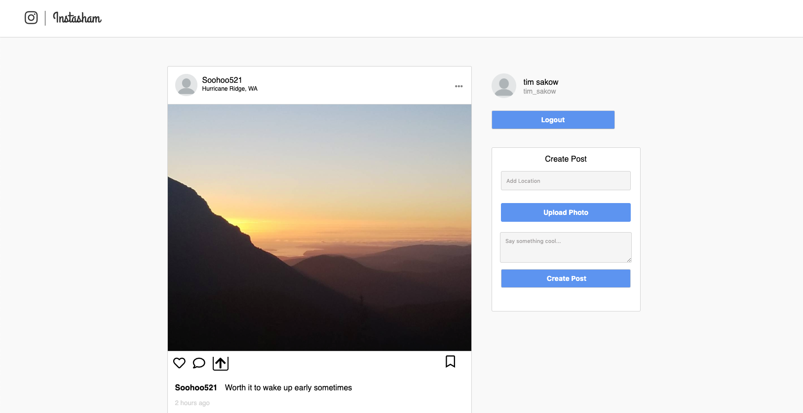
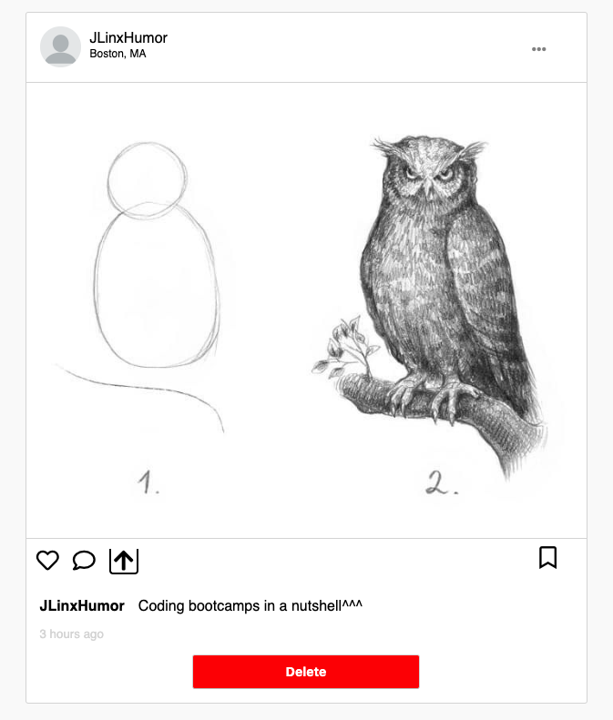

# README

## Live: [Instasham](https://instagramsham.herokuapp.com/#/ "Instasham")

Instasham is single-page web application cloning the popular social-media app [Instagram](https://www.instagram.com/ "Instagram"). 
Users can sign up, and instantly start sharing photos with friends!

# Feature Highlights

## Feed
Instasham's most important feature is the ability to
share your photos with others in a clean photo feed. 
User's photos will be added to a public feed where other
users can view and interact with the posts.
    

## Posting
To become an active member of the Instasham community
users can quickly find the upload post form and start
sharing the world from their point of view with the 
ability to post a location, image, and story snippet to
their art.

# Technologies
Development technologies used in the making of 
`Instasham` include:
 * Backend
    * Ruby
    * Rails
    * PostgreSQL
* File Storage
    * Amazon Web Services
* Frontend
    * JavaScript
    * React
    * Redux

# Future Implementations
* User Profiles with personal show pagse of content
* User interactions such as:
    * Likes
    * Comments
    * Sharing
    * Bookmarking